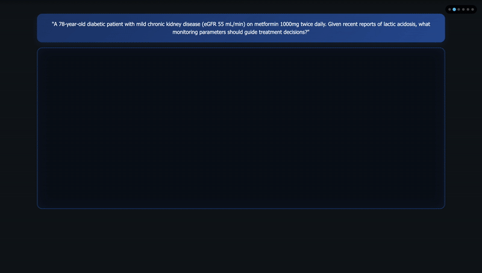

# AMG-RAG: Agentic Medical Graph-RAG

[](https://www.python.org/downloads/release/python-380/)
[](https://opensource.org/licenses/MIT)
[](https://arxiv.org/abs/2502.13010)

## Overview

**AMG-RAG (Agentic Medical Graph-RAG)** is a comprehensive framework that automates the construction and continuous updating of Medical Knowledge Graphs (MKGs), integrates reasoning, and retrieves current external evidence for medical Question Answering (QA). Our approach addresses the challenge of rapidly evolving medical knowledge by dynamically linking new findings and complex medical concepts.



## 🚀 Key Features

- **🧠 Enhanced Knowledge Graph Construction**: Advanced entity extraction with confidence scoring (1-10 scale)
- **🔄 Bidirectional Relationship Analysis**: Comprehensive relationship mapping with confidence scoring
- **🎯 Context-Aware Entity Processing**: LLM-generated descriptions with medical context integration
- **📚 Multi-source Evidence Retrieval**: Integrates PubMed search, Wikipedia, and vector database retrieval
- **🔗 Chain-of-Thought Reasoning**: Structured reasoning synthesis with evidence integration
- **⚡ Real-time Graph Updates**: Dynamically incorporates latest medical literature and research
- **📊 Entity Summarization**: Enhanced entity understanding with relevance-based confidence scoring

## 📈 Performance

Our evaluations on standard medical QA benchmarks demonstrate superior performance:

| Dataset | Score | Metric |
|---------|-------|--------|
| **MEDQA** | 74.1% | F1 Score |
| **MEDMCQA** | 66.34% | Accuracy |

AMG-RAG surpasses both comparable models and those 10 to 100 times larger, while enhancing interpretability for medical queries.

## 🏗️ Architecture

The enhanced AMG-RAG system consists of six key components:

### 1. Enhanced Entity Extraction
- Structured output with relevance scoring (1-10 scale)
- Context-aware entity descriptions
- Confidence scoring based on relevance and external sources

### 2. Advanced Knowledge Graph Construction
- Bidirectional relationship analysis (A→B and B→A)
- Medical relationship types (treats, causes, symptom_of, risk_factor_for, etc.)
- Evidence-based confidence scoring

### 3. Multi-source Evidence Retrieval
- PubMed API integration for latest research
- Wikipedia fallback for additional context
- Vector database semantic search

### 4. Entity Summarization
- LLM-generated enhanced summaries
- Relevance-based confidence updates
- Context integration for better understanding

### 5. Chain-of-Thought Reasoning
- Structured reasoning synthesis with evidence integration
- Graph-based path exploration
- Confidence propagation through reasoning chains

### 6. Final Answer Generation
- Multi-evidence integration for answer selection
- Confidence scoring and explanation generation

## 🛠️ Installation


### Prerequisites

- Python 3.8+
- OpenAI API key (or Ollama for local inference)
- PubMed API key (optional, for higher rate limits)


### Quick Install

```bash
# Clone the repository
git clone https://github.com/MrRezaeiUofT/AMG-RAG.git
cd AMG-RAG

# Install core dependencies
pip install langchain langchain-community langchain-openai
pip install transformers langgraph pandas numpy requests wikipedia networkx python-decouple

# Optional: Install additional packages
pip install langchain-huggingface langchain-chroma langchain-ollama
```

### Environment Setup

Create a `.env` file in the root directory:

```env
OPENAI_API_KEY=your_openai_api_key_here
pubmed_api=your_pubmed_api_key_here
```

## 🚀 Quick Start

### Basic Usage

```python
from AMG_with_KG import AMG_RAG_System

# Initialize the system
system = AMG_RAG_System(use_openai=True, openai_key="your-api-key")

# Sample medical question
question_data = {
    "question": "A 45-year-old man presents with severe chest pain...",
    "options": {
        "A": "Unstable angina",
        "B": "Acute inferior wall myocardial infarction",
        "C": "Acute anterior wall myocardial infarction",
        "D": "Aortic dissection",
        "E": "Pulmonary embolism"
    },
    "answer": "B"
}

# Get answer with reasoning
result = system.answer_question(question_data)

print(f"Answer: {result['answer']}")
print(f"Confidence: {result['confidence']:.2f}")
print(f"Explanation: {result['explanation']}")
```

### Knowledge Graph Exploration

```python
# Access the knowledge graph
kg = system.kg

# Explore entities
for entity_name, entity in kg.entities.items():
    print(f"Entity: {entity_name}")
    print(f"Type: {entity.entity_type}")
    print(f"Confidence: {entity.confidence:.2f}")
    print(f"Description: {entity.description[:100]}...")

# Explore relationships
for relation in kg.relations:
    print(f"{relation.source} --[{relation.relation_type}]--> {relation.target}")
    print(f"Confidence: {relation.confidence:.2f}")
```

## 📊 Data Format

The system expects input data in JSONL format:

```json
{
  "question": "Medical question text",
  "options": {
    "A": "Option A text",
    "B": "Option B text", 
    "C": "Option C text",
    "D": "Option D text"
  },
  "answer": "B",
  "answer_idx": 1,
  "meta_info": "Additional metadata"
}
```

## ⚙️ Configuration

### Model Selection

```python
# OpenAI (recommended)
system = AMG_RAG_System(use_openai=True, openai_key="your-api-key")

# Local Ollama
system = AMG_RAG_System(use_openai=False)
```

### Knowledge Graph Parameters

```python
# Entity extraction settings
max_entities = 8              # Maximum entities per question
relevance_threshold = 5       # Minimum relevance score (1-10)

# Relationship analysis settings
confidence_threshold = 0.3    # Minimum confidence for relationships
max_relationship_depth = 2    # Maximum exploration depth

# Search parameters
pubmed_max_results = 3        # Max PubMed articles
wikipedia_sentences = 3       # Wikipedia summary length
```

## 📁 Project Structure

```
AMG-RAG/
├── AMG-with-KG.py          # Main AMG-RAG system
├── Simple_AMG_RAG.py       # Simplified version
├── create_VDB.py           # Vector database utilities
├── dataset/                # Input datasets
│   ├── MEDQA/             # MEDQA dataset
│   ├── MedMCQA/           # MedMCQA dataset
│   └── PubMedQA/          # PubMedQA dataset
├── results/                # Output results
├── new_VDB/               # Vector database storage
├── requirements.txt        # Dependencies
├── .env                   # Environment variables
└── README.md             # This file
```

## 🆕 What's New in v2.0

- **🎯 Relevance Scoring**: 1-10 scale for entity importance
- **🔄 Bidirectional Relationships**: Comprehensive A→B and B→A analysis
- **🌐 Context Integration**: PubMed and Wikipedia context for better understanding
- **📝 Entity Summarization**: LLM-generated enhanced descriptions

## 📄 Citation

If you use AMG-RAG in your research, please cite our paper:

```bibtex
@inproceedings{rezaei-etal-2025-agentic,
    title = "Agentic Medical Knowledge Graphs Enhance Medical Question Answering: Bridging the Gap Between {LLM}s and Evolving Medical Knowledge",
    author = "Rezaei, Mohammad Reza  and
      Fard, Reza Saadati  and
      Parker, Jayson Lee  and
      Krishnan, Rahul G  and
      Lankarany, Milad",
    editor = "Christodoulopoulos, Christos  and
      Chakraborty, Tanmoy  and
      Rose, Carolyn  and
      Peng, Violet",
    booktitle = "Findings of the Association for Computational Linguistics: EMNLP 2025",
    month = nov,
    year = "2025",
    address = "Suzhou, China",
    publisher = "Association for Computational Linguistics",
    url = "https://aclanthology.org/2025.findings-emnlp.679/",
    doi = "10.18653/v1/2025.findings-emnlp.679",
    pages = "12682--12701",
    ISBN = "979-8-89176-335-7",
    abstract = "Large Language Models (LLMs) have greatly advanced medical Question Answering (QA) by leveraging vast clinical data and medical literature. However, the rapid evolution of medical knowledge and the labor-intensive process of manually updating domain-specific resources can undermine the reliability of these systems. We address this challenge with Agentic Medical Graph-RAG (AMG-RAG), a comprehensive framework that automates the construction and continuous updating of Medical Knowledge Graph (MKG), integrates reasoning, and retrieves current external evidence from the MKG for medical QA.Evaluations on the MEDQA and MEDMCQA benchmarks demonstrate the effectiveness of AMG-RAG, achieving an F1 score of 74.1{\%} on MEDQA and an accuracy of 66.34{\%} on MEDMCQA{---}surpassing both comparable models and those 10 to 100 times larger. By dynamically linking new findings and complex medical concepts, AMG-RAG not only boosts accuracy but also enhances interpretability for medical queries, which has a critical impact on delivering up-to-date, trustworthy medical insights."
}
```

## 📜 License

This project is licensed under the Apache-2.0 License - see the [LICENSE](LICENSE) file for details.

## 🙏 Acknowledgments

- Built with [LangChain](https://langchain.com/) and [LangGraph](https://langgraph-sdk.vercel.app/)
- Uses [Hugging Face Transformers](https://huggingface.co/transformers/) for embeddings
- Integrates [PubMed API](https://www.ncbi.nlm.nih.gov/home/develop/api/) for medical literature retrieval
- Enhanced with [NetworkX](https://networkx.org/) for knowledge graph operations
- Benchmarked on [MEDQA](https://github.com/jind11/MedQA) and [MEDMCQA](https://medmcqa.github.io/) medical datasets


